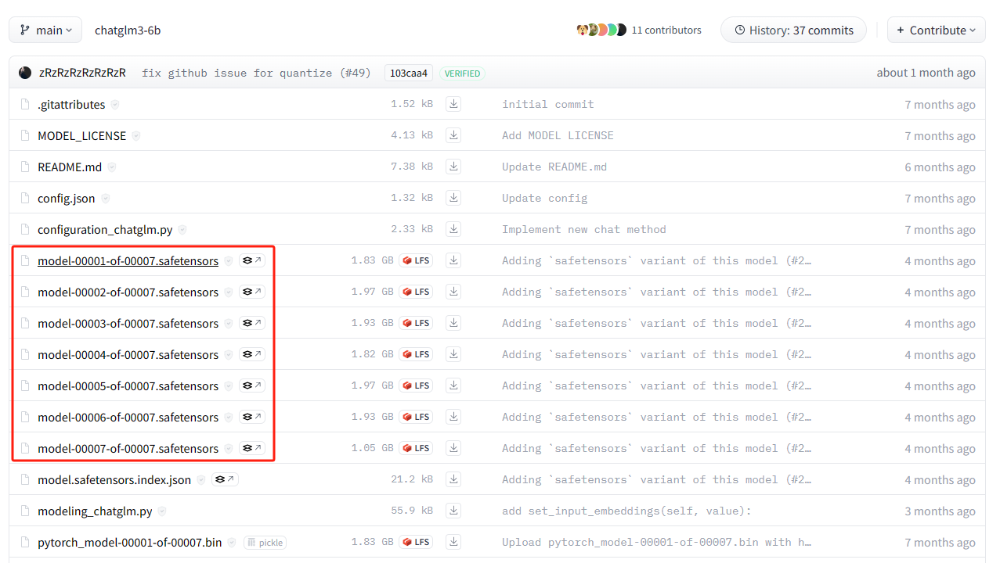

# 动手实现 ChatGLM3-6B

这篇教程是对[ChatGLM3-6B](https://huggingface.co/THUDM/chatglm3-6b)的动手实现版本，目前已脱离transformers依赖work了，对模型架构的讲解估计要咕很久才能写明白。

## 0、模型架构讲解

连载中

## 1、下载模型权重

在实现模型之前，请先下载原始的模型权重，咱们只需要模型仓库里的`safetensors`文件，只有这部分是真正使用到的权重。


另外还有一个模型是tokenizer模型（`tokenizer.model`），这个俺已经放本仓库里了，不用过去下载了。

就在这目录上运行以下命令，将权重下载到`weights`目录下，后续咱们就可以直接加载了。

```bash
pip install -U "huggingface_hub[cli]"
export HF_ENDPOINT=https://hf-mirror.com
huggingface-cli download THUDM/chatglm3-6b --include "*.safetensors" --local-dir weights
```

上述指令的第二行是使用[hf-mirror](https://hf-mirror.com)镜像加速下载，针对国内用户，如果你的网络可以直接访问huggingface则可以跳过。

如果是windows用户，这第二行就按shell的类型修改下

```bash
# 针对powershell
$env:HF_ENDPOINT = "https://hf-mirror.com"
# 针对cmd
set HF_ENDPOINT = "https://hf-mirror.com"
```

## 2、加载模型权重 & 推理

[加载模型权重](./加载模型权重.ipynb)

## 3、实现各种采样策略

连载中

## 4、实现多轮对话（Chat Format）

连载中

