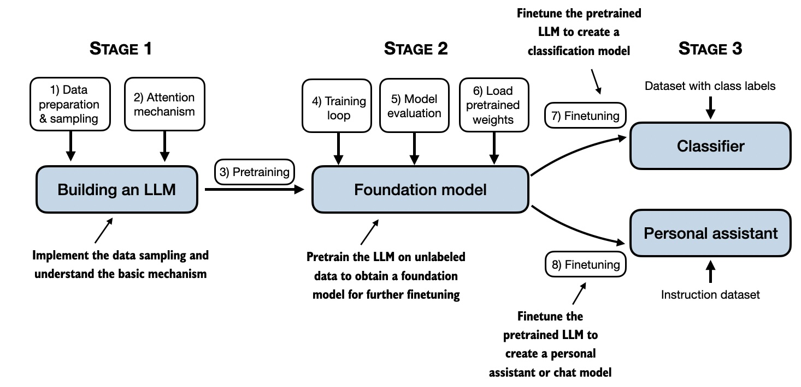

# 动手学LLM

# LLMs From Scratch: Hands-on Building Your Own Large Language Models

---

## 📘 项目介绍
如果你想从0手写代码，构建大语言模型，本项目很适合你。
本项目 "LLMs From Scratch" 是由 Datawhale 提供的一个从头开始构建类似 ChatGPT 大型语言模型（LLM）的实践教程。
我们旨在通过详细的指导、代码示例和深度学习资源，帮助开发者和研究者掌握创建大语言模型和大语言模型架构的核心技术。
本项目包括了从0逐步构建GLM4\Llama3\RWKV6的教程，从0构建大模型，一起深入理解大模型原理。

---

## 🌟 项目亮点

- **全面的学习路径**: 提供从基础理论到实际编码的系统化学习路径。
- **实践导向**: 强调通过实际操作掌握 LLM 的开发和训练。
- **重点关注LLM架构**: 在微调、部署相关教程较为丰富的背景下，我们着重关注大模型的架构实现。

## 🚀 主要内容

### （1）基础知识

在基础知识部分，我们基于"rasbt/LLMs-from-scratch"提供了一个如何从头开始实现类似ChatGPT的大语言模型（LLM）的详细教程，特别感谢@[rasbt](https://github.com/rasbt)。

如果你想快速入门，请参考Codes路径下的notebook，简洁的代码可以帮助你快速入门。

如果你想详细学习，请参考Translated_Book路径下的notebook，提供了更为详细的相关知识。

👨‍💻 **代码实现**: 该项目包含了创建GPT-like大语言模型的全部代码，涵盖了编码、预训练和微调过程。

📖 **逐步学习**: 教程通过清晰的文本、图表和示例，分步骤教授如何创建自己的LLM。

💡 **教育目的**: 该方法主要用于教育，帮助学习者训练和开发小型但功能性的模型，这与创建像ChatGPT这样的大型基础模型的方法相似。

🔧 **简洁易懂的代码**: 利用简洁且可运行的notebook代码，即使只有PyTorch基础，也能完成大模型的构建。

🤔 **深入理解模型原理**: 通过本教程，读者可以深入理解大型语言模型的工作原理。

📖 详细章节安排如下：

| 章节标题                          | 主要代码                                                                                                     | 所有代码和补充                                                                                         |
|-----------------------------------|----------------------------------------------------------------------------------------------------------------|-------------------------------------------------------------------------------------------------------|
| 第1章: 理解大型语言模型           | 没有代码                                                                                                        | 没有代码                                                                                               |
| 第2章: 处理文本数据               | - [ch02.ipynb](./Codes/ch02/01_main-chapter-code/ch02.ipynb) - [dataloader.ipynb](./Codes/ch02/01_main-chapter-code/dataloader.ipynb) - [exercise-solutions.ipynb](./Codes/ch02/01_main-chapter-code/exercise-solutions.ipynb) | [./Codes/ch02](./Codes/ch02)                                                                          |
| 第3章: 编写注意力机制             | - [ch03.ipynb](./Codes/ch03/01_main-chapter-code/ch03.ipynb) - [multihead-attention.ipynb](./Codes/ch03/01_main-chapter-code/multihead-attention.ipynb) - [exercise-solutions.ipynb](./Codes/ch03/01_main-chapter-code/exercise-solutions.ipynb) | [./Codes/ch03](./Codes/ch03)                                                                          |
| 第4章: 从零开始实现GPT模型        | - [ch04.ipynb](./Codes/ch04/01_main-chapter-code/ch04.ipynb) - [gpt.py](./Codes/ch04/01_main-chapter-code/gpt.py) - [exercise-solutions.ipynb](./Codes/ch04/01_main-chapter-code/exercise-solutions.ipynb)                 | [./Codes/ch04](./Codes/ch04)                                                                          |
| 第5章: 使用未标记数据进行预训练   | - [ch05.ipynb](./Codes/ch05/01_main-chapter-code/ch05.ipynb) - [train.py](./Codes/ch05/01_main-chapter-code/train.py) - [generate.py](./Codes/ch05/01_main-chapter-code/generate.py) - [exercise-solutions.ipynb](./Codes/ch05/01_main-chapter-code/exercise-solutions.ipynb) | [./Codes/ch05](./Codes/ch05)                                                                          |
| 第6章: 用于文本分类的微调         | 即将发布                                                                                                         | 即将发布                                                                                               |
| 第7章: 使用人类反馈进行微调       | 即将发布                                                                                                         | 即将发布                                                                                               |
| 第8章: 在实践中使用大型语言模型   | 即将发布                                                                                                         | 即将发布                                                                                               |
| 附录A: PyTorch简介                | - [code-part1.ipynb](./Codes/appendix-A/03_main-chapter-code/code-part1.ipynb) - [code-part2.ipynb](./Codes/appendix-A/03_main-chapter-code/code-part2.ipynb) - [DDP-script.py](./Codes/appendix-A/03_main-chapter-code/DDP-script.py) - [exercise-solutions.ipynb](./Codes/appendix-A/03_main-chapter-code/exercise-solutions.ipynb) | [appendix-A](./Codes/appendix-A)                                                                       |
| 附录B: 参考文献和进一步的阅读材料 | 没有代码                                                                                                        | -                                                                                                      |
| 附录C: 练习                       | 没有代码                                                                                                        | -                                                                                                      |
| 附录D: 为训练过程添加额外的功能和特性 | - [appendix-D.ipynb](./Codes/appendix-D/01_main-chapter-code/appendix-D.ipynb)                                        | [appendix-D](./Codes/appendix-D)                                                                       |

---

### （2）模型架构的讨论和搭建

- **支持多种大型模型**: 项目涵盖了 ChatGLM、Llama、RWKV 等多个大型模型的架构讨论与实现，详见 `./Model_Architecture_Discussions` 目录。
- **架构详细解析**: 包括每个模型的配置文件、训练脚本和核心代码，帮助学习者深入理解不同模型的内部机制。

| 模型类型 | Notebook 笔记本 | 贡献者 |
| --- | --- | --- |
| ChatGLM3 | [chatglm3.ipynb](./Model_Architecture_Discussions/ChatGLM3/加载模型权重.ipynb) | [@Tangent-90C](https://github.com/Tangent-90C) |
| Llama3 | [llama3.ipynb](./Model_Architecture_Discussions/llama3/llama3-from-scratch.ipynb) | [@A10-research](https://www.aaaaaaaaaa.org/) |
| RWKV V2 | [rwkv-v2.ipynb](./Model_Architecture_Discussions/rwkv-v2/rwkv-v2-guide.ipynb) | [@Ethan-Chen-plus](https://github.com/Ethan-Chen-plus) |
| RWKV V3 | [rwkv-v3.ipynb](./Model_Architecture_Discussions/rwkv-v3/rwkv-v3-guide.ipynb) | [@Ethan-Chen-plus](https://github.com/Ethan-Chen-plus) |
| RWKV V4 | [rwkv-v4.ipynb](./Model_Architecture_Discussions/rwkv-v4/rwkv-v4-guide.ipynb) | [@Ethan-Chen-plus](https://github.com/Ethan-Chen-plus) |
| RWKV V5 | [rwkv-v5.ipynb](./Model_Architecture_Discussions/rwkv-v5/rwkv-v5-guide.ipynb) | [@Ethan-Chen-plus](https://github.com/Ethan-Chen-plus) |
| RWKV V6 | [rwkv-v6.ipynb](./Model_Architecture_Discussions/rwkv-v6/rwkv-v6-guide.ipynb) | [@Ethan-Chen-plus](https://github.com/Ethan-Chen-plus) |
| ChatGLM4 | [chatglm4.ipynb](./Model_Architecture_Discussions/ChatGLM4/chatglm4-guide.ipynb) | [@Ethan-Chen-plus](https://github.com/Ethan-Chen-plus) |
| MiniCPM | [minicpm.ipynb](./Model_Architecture_Discussions/MiniCPM/MiniCPM.ipynb) | [@0-yy-0](https://github.com/0-yy-0) |

---

---

## 📅 Roadmap

*注：规划未来任务，并通过 Issue 形式对外发布。*

---

## 👫 参与贡献

- 如果你想参与到项目中，欢迎查看项目的 [Issue](https://github.com/datawhalechina/llms-from-scratch-cn/issues) 查看没有被分配的任务。
- 如果你发现了问题，请在 [Issue](https://github.com/datawhalechina/llms-from-scratch-cn/issues) 中进行反馈🐛。
- 如果你对本项目感兴趣，欢迎通过 [Discussion](https://github.com/datawhalechina/llms-from-scratch-cn/discussions) 进行交流💬。

  

- 项目受众
- 
  - 技术背景：该项目适合有一定编程基础的人员，特别是对大型语言模型（LLM）感兴趣的开发者和研究者。
  - 学习目标：适合那些希望深入了解LLM工作原理，并愿意投入时间从零开始构建和训练自己的LLM的学习者。
  - 应用领域：适用于对自然语言处理、人工智能领域感兴趣的开发者，以及希望在教育或研究环境中应用LLM的人员。
- 项目亮点

  - 系统化学习：该项目提供了一个系统化的学习路径，从理论基础到实际编码，帮助学习者全面理解LLM。
  - 实践导向：与仅仅介绍理论或API使用不同，该项目强调实践，让学习者通过实际操作来掌握LLM的开发和训练。
  - 深入浅出：该项目以清晰的语言、图表和示例来解释复杂的概念，使得非专业背景的学习者也能较好地理解。

如果你对 Datawhale 很感兴趣并想要发起一个新的项目，欢迎查看 [Datawhale 贡献指南](https://github.com/datawhalechina/DOPMC#%E4%B8%BA-datawhale-%E5%81%9A%E5%87%BA%E8%B4%A1%E7%8C%AE)。

希望这个项目能够帮助你更好地理解和构建大型语言模型！ 🌐

## 贡献者名单（教程部分）

| 姓名   | 职责        | 简介         | GitHub |
| :-----:| :----------:| :-----------:|:------:|
| 陈可为 | 项目负责人  | 中国科学院大学 |[@Ethan-Chen-plus](https://github.com/Ethan-Chen-plus)|
| 王训志 | 第2章贡献者 | 南开大学     |[@aJupyter](https://github.com/aJupyter)|
| 汪健麟 | 第2章贡献者 |              ||
| Aria  | 第2章贡献者 |             |[@ariafyy](https://github.com/ariafyy)|
| 汪健麟 | 第2章贡献者 |              ||
| 张友东 | 第3章贡献者 |              ||
| 邹雨衡 | 第3章贡献者 |              ||
| 曹 妍  | 第3章贡献者 |              |[@SamanthaTso](https://github.com/SamanthaTso)|
| 陈嘉诺 | 第4章贡献者 |   广州大学    |[@Tangent-90C](https://github.com/Tangent-90C)|
| 高立业 | 第4章贡献者 |              |[@0-yy-0](https://github.com/0-yy-0)|
| 蒋文力 | 第4章贡献者 |              |[@morcake](https://github.com/morcake)|
| 丁悦 | 第5章贡献者 | 哈尔滨工业大学（威海）|[@dingyue772](https://github.com/dingyue772)|
| 周景林 | 附录贡献者  |              |[@Beyondzjl](https://github.com/Beyondzjl)|
| 陈可为 | 附录贡献者  |              |[@Ethan-Chen-plus](https://github.com/Ethan-Chen-plus)|

## 关注我们

扫描下方二维码关注公众号：Datawhale

## LICENSE

 本作品采用<a rel="license" href="http://creativecommons.org/licenses/by-nc-sa/4.0/">知识共享署名-非商业性使用-相同方式共享 4.0 国际许可协议</a>进行许可。

*注：默认使用CC 4.0协议，也可根据自身项目情况选用其他协议*
