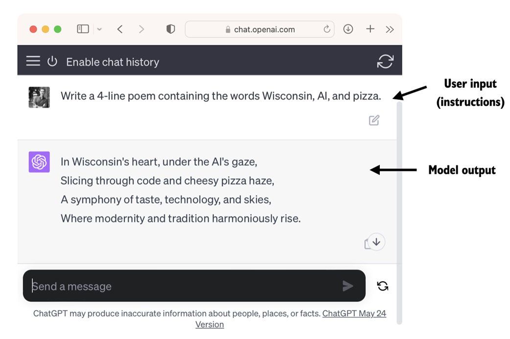

### 1.2 LLMs的应用（Applications of LLMs）

Owing to their advanced capabilities to parse and understand unstructured text data, LLMs have a broad range of applications across various domains. Today, LLMs are employed for machine translation, generation of novel texts (see Figure 1.2), sentiment analysis, text summarization, and many other tasks. LLMs have recently been used for content creation, such as writing fiction, articles, and even computer code.

由于 LLM 具备解析和理解非结构化文本数据的高级能力，因此在各个领域都有广泛的应用。如今，LLM 已被用于机器翻译、生成新文本（见图 1.2）、情感分析、文本摘要以及许多其他任务。最近，LLM 还被用于内容创作，如撰写小说、文章甚至计算机代码。

> 本句的注解和说明如下：
1. **解析和理解非结构化文本数据的高级能力**：非结构化文本数据是指那些没有固定格式或结构的文本，如普通文本文件、电子邮件内容、网页文本等。LLM通过深度学习技术，能够识别和处理这类数据中的复杂语言结构和含义。
2. **机器翻译**：指的是将一种语言的文本自动翻译成另一种语言的技术，LLM因其强大的语言理解能力而被用于提高机器翻译的质量和流畅性。
3. **生成新文本**：LLM不仅能够理解现有文本，还能够创造全新的文本内容，这在自动文稿撰写、聊天机器人回复生成等方面有广泛应用。
4. **情感分析**：这是一种分析文本以确定作者或说话者情感倾向的技术，LLM能够识别和解释文本中的情感色彩。
5. **文本摘要**：指的是将长篇文章或文档压缩成短小精悍的摘要，LLM能够提取关键信息并生成摘要。

*「本句强调了LLM在自然语言处理领域的高级能力，以及它们在多个不同领域的广泛应用潜力，特别是在内容创作方面，LLM已经开始展现出能够生成各种类型文本的能力。」*

Figure 1.2 LLM interfaces enable natural language communication between users and AI systems. This screenshot shows ChatGPT writing a poem according to a user's specifications. LLMs can also power sophisticated chatbots and virtual assistants, such as OpenAI's ChatGPT or Google's Gemini (formerly called Bard), which can answer user queries and augment traditional search engines such as Google Search or Microsoft Bing.

图 1.2 LLM 界面实现了用户与人工智能系统之间的自然语言交流。这张截图显示的是 ChatGPT 根据用户的要求写了一首诗。LLM 还能为复杂的聊天机器人和虚拟助手提供动力，例如 OpenAI 的 ChatGPT 或谷歌的 Gemini（原名 Bard），它们可以回答用户的询问，并增强传统搜索引擎的功能，如谷歌搜索或微软必应。

Moreover, LLMs may be used for effective knowledge retrieval from vast volumes of text in specialized areas such as medicine or law. This includes sifting through documents, summarizing lengthy passages, and answering technical questions.

此外，LLM 还可用于从医学或法律等专业领域的大量文本中进行有效的知识检索。这包括筛选文档、总结冗长段落和回答技术问题。

> 本句的注解和说明如下：
1. **可用于从医学或法律等专业领域的大量文本中进行有效的知识检索**：本句说明LLM不仅适用于通用语言处理，还能够处理专业领域的文本数据。知识检索是指在大量文本中查找和提取所需信息的过程，而这种其实为了更专业回答相关问题，会涉及*RAG*相关技术的使用。而这正是大模型的两个比较火热的应用研究方向之一，另外一个是*Agent*相关技术。

In short, LLMs are invaluable for automating almost any task that involves parsing and generating text. Their applications are virtually endless, and as we continue to innovate and explore new ways to use these models, it's clear that LLMs have the potential to redefine our relationship with technology, making it more conversational, intuitive, and accessible.

简而言之，LLM 对于自动化几乎所有涉及解析和生成文本的任务来说都是无价之宝。它们的应用几乎是无穷无尽的，随着我们不断创新和探索使用这些模型的新方法，很明显，LLM 有可能重新定义我们与技术的关系，使其更加会话、直观和易用。

In this book, we will focus on understanding how LLMs work from the ground up, coding an LLM that can generate texts. We will also learn about techniques that allow LLMs to carry out queries, ranging from answering questions to summarizing text, translating text into different languages, and more. In other words, in this book, we will learn how complex LLM assistants such as ChatGPT work by building one step by step.

在本书中，我们将重点了解 LLM 如何从头开始工作，编码一个可以生成文本的 LLM。我们还将学习让 LLM 执行查询的技术，包括回答问题、总结文本、将文本翻译成不同语言等。换句话说，在本书中，我们将通过一步步构建 ChatGPT 等复杂的 LLM 助手，了解其工作原理。
